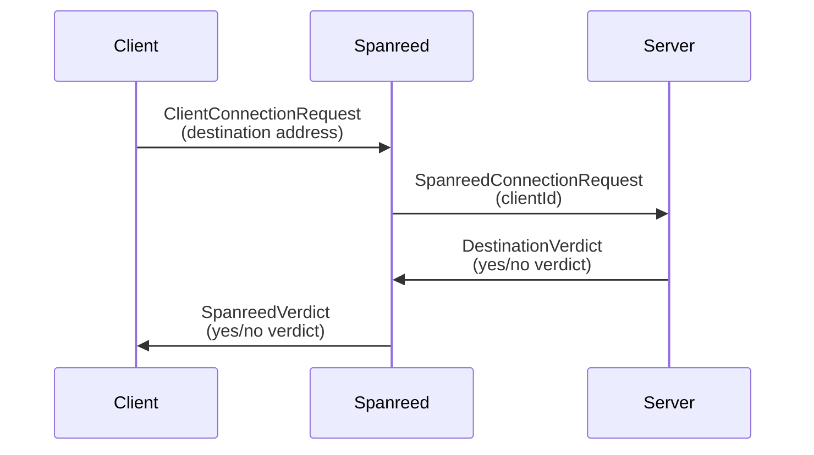

# spanreed-netcode-proxy

Proxy to forward messages from Web APIs (WebTransport etc.) to game servers that use UDP/TCP

Useful for connecting to traditional game servers from a browser, which doesn't support raw TCP connections or UDP messaging.

Works via ~~an extremely frantic fabrial operator~~ excellent Go support for Web API backends and standard low-level IETF transport protocols.

# Basic Usage

## Client / Server Connections

To establish a new connection, send a `ClientConnectionRequest` message to a Spanreed proxy. The proxy extracts information about how to contact the destination game server, assigns a new client ID to the connection, and sends a `SpanreedConnectionRequest` to the destination game server.

TODO (sessamekesh): Write a simple demo example for C++ backend and TypeScript frontend and reference it here.

To close a connection from the client side, either:
1. Close the underlying transport connection
2. Send a `ClientDisconnectionRequest` message to request a graceful disconnection
3. Fail to send a message for `SPAN_CLIENT_MSG_TIMEOUT` seconds (default: 60).

To close a connection from the server side, either:
1. Close the underlying transport connection (if appropriate)
2. Send a `DestinationDisconnectionRequest` message to request a graceful disconnection
3. Fail to send a message for `SPAN_DEST_MSG_TIMEOUT` seconds (default: 60).

# Message Formats

Read about message formats in [MESSAGE_FORMATS.md](./MESSAGE_FORMATS.md).

> TODO (sessamekesh): Actually write these.

I've provided parsers for a few languages (C++, TypeScript, Rust, Go) under the `parser_utilities` directory.