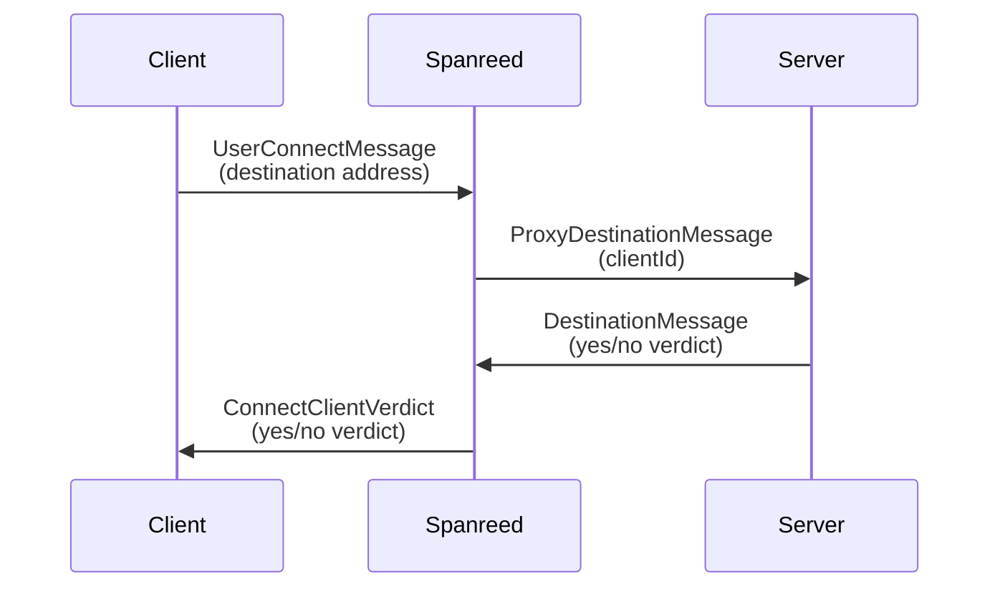

# spanreed-netcode-proxy

Proxy to forward messages from Web APIs (WebTransport etc.) to game servers that use UDP/TCP

Useful for connecting to traditional game servers from a browser, which doesn't support raw TCP connections or UDP messaging.

Works via ~~an extremely frantic fabrial operator~~ excellent Go support for Web API backends and standard low-level IETF transport protocols.

# Basic Usage

A binary has been provided that includes support for forwarding UDP packets, and receiving WebSocket and WebTransport client connections. This binary can be found under [cmd/spanreed-hub](cmd/spanreed-hub) (be sure to read the associated README.md file).

# Examples

## Hello, Spanreed!

Simple app where players click on a canvas to spawn short-lived colorful dots, and can send chat messages to everyone attached to the game server. Found under [examples/hello-spanreed](examples/hello-spanreed/).

# Client / Server Connections

_Message formats use flatbuffers - schema and pre-compiled files are included in the flatbuffers directory_.

To establish a new connection, send a `UserConnectMessage` message to a Spanreed proxy. The proxy extracts information about how to contact the destination game server, assigns a new client ID to the connection, and sends a `ProxyDestinationMessage` to the destination game server.

The destination server decides if it wants to accept the connection, and returns a `DestinationMessage` message with a `ConnectionVerdict` back to the proxy. The proxy then forwards this decision back to the client in the form of a `ConnectClientVerdict`.

## Client send/receive flow

Client data is received as raw binary information, with no additional notion of a client ID. WebSocket and WebTransport connections are exactly that - connections - so no client metadata is required after the connection is established.

## Destination send/receive flow.

Destination data is sent from Spanreed as a `ProxyDestinationMessage`, which contains three possible types of sub-message:
1. `ProxyDestConnectionRequest`, used when establishing a new connection for a new client.
2. `ProxyDestClientMessage`, used when forwarding a message from a previously connected client.
3. `ProxyDestCloseConnection`, used when the proxy is requesting a connection close for some reason.

Each of these types also allows `app_data` to be set, which is an application-specific buffer of arbitrary bytes.

Destination data should be sent to Spanreed in the form of a `DestinationMessage`, which can similarly contain one of three possible types of sub-message:
1. `ConnectionVerdict`, gives a yes/no response for allowing a client connection with a given client ID.
2. `ProxyMessage`, requests a message to be forwarded on to a connected client.
3. `CloseConnection`, requests that a client connection be closed.
